# Amazon Ratings Prediction
## Introduction

Selling products on Amazon is challenging. For any given product, you have a lot of competition from other sellers that sell similar or the same item. Buyers on Amazon rely heavily on customer reviews and their overall ratings; people tend to buy products with higher ratings. Last but not least, as a seller, one has to find a “good” price to give their products a competitive advantage over their competitors. Thus, we chose to analyze the Amazon Products Dataset.

Our primary goal is to develop a machine learning model that helps sellers on Amazon find the optimal discount prices/rates for their products. We defined “optimal” in our project as the price that will result in the highest rating, as people tend to sway significantly based on ratings of a product. Keeping this in mind, we developed three different models that predict the rating of a product based on its original price, discounted price, and number of ratings.

By building a “good” predictive model, sellers on Amazon can maximize their profit and product rating by discounting their products at the right amount. This also benefits the buyers as they can purchase items at more competitive prices.
## Methods
- Exploration results
- Preprocessing steps
- Models chosen in the order they were executed
- Parameters chosen
- Subsection for each step
###Data Exploration

Upon downloading the Amazon Product Dataset, which is divided into 142 subcategories, we explored a select number of them as a Pandas Dataframe. We reviewed their columns and variable types. We checked how many instances we had for each subcategory. We plotted histograms for columns ratings, number_of_ratings, discount_price, and actual_price. Last but not least, we looked into correlations between the features and plotted pairplots to see their distributions. 

Upon looking at most of the subcategories, we decided to pursue 3 of them and combine all of the instances into a Pandas Dataframe.
### Preprocessing

The first task that we did was to drop null values. After viewing some samples of the data, we found null values in ratings, no_of_ratings, actual_price, and discount_price. We then found out that some instances of ratings and no_of_ratings do not contain float values in string (all the columns were in string format upon import). We handled those edge cases and dropped the instances as well.

We simultaneously converted all ratings, no_of_ratings, actual_price, and discount_price from string to float. As for actual_price and discount_price, we converted them to usd, as they were in rupees upon import. We used the exchange rate as of 02/08/24.

We then created new columns. We calculated the discount_rate of each instance using actual_price and discount_price. The equation is as follows:
discount_rate = (actual_price - discount_price)/actual_price
We also calculated the aggregate rating, agg_rating, by multiplying the ratings and no_of_ratings columns.

Last but not least, we normalized the data using min-max normalization. 

To enhance the flexibility of our model, we converted the sub_category into integer values representing categories. We merged the rating datasets for Amazon Fashion, Televisions, and Luxury Beauty into one dataset, mapping the categories as follows: Amazon Fashion: 0 Televisions: 1 Luxury Beauty: 2

[Preprocessing](https://github.com/mickjeon/amazon_sales_prediction/blob/main/preprocessing.ipynb)

### Model 1: Polynomial Regression Model
We chose polynomial regression as our first model. In order to find the best degree for our model, we trained and evaluated polynomial regression models with degrees from 1 to 9. We used mean_squared_error as our loss function and metric.

[polynomial_regression](https://github.com/mickjeon/amazon_sales_prediction/blob/main/polynomial_regression.ipynb)
### Model 2: Artificial Neural Network
For the second model, we developed an Artificial Neural Network. We decided to train our ANN using the original rating scale of 1-5 before normalization. We trained our baseline ANN and analyzed its performance using mean_squared_error loss. We performed validation while training to track validation loss as well. The baseline ANN was trained for 100 epochs, batch_size of 4, and the validation set was 10% of the training dataset.

We then performed Repeated K-Fold Cross Validation to validate the performance of our baseline model. Last but not least, we performed hyperparameter tuning using random search in order to find a better ANN for our data. Both K-Fold Cross Validation and Hyperparameter tuning also followed the 100 epoch and batch_size=4 pattern from the baseline model.

[ANN_baseline](https://github.com/mickjeon/amazon_sales_prediction/blob/main/baseline_ann.ipynb)

[ANN_cross_validation](https://github.com/mickjeon/amazon_sales_prediction/blob/main/kfold_validation_ann.ipynb)

[ANN_hyper_tuning](https://github.com/mickjeon/amazon_sales_prediction/blob/main/ANN_hyper_tuning.ipynb) 

### Model 3: Decision Tree Regressor
The third model is a Decision Tree Regressor. We built a baseline model using the squared_error criterion and max number of depths=2. To find a better Decision Tree Regressor, we performed hyperparameter tuning. We conducted an exhaustive search and looked for the best criterion among ["squared_error", "friedman_mse", "absolute_error", "poisson”] and maximum number of depths among [1 through 40]. We used mean_squared_error as our metric for evaluating the regression.

[Decision_tree_regressor](https://github.com/mickjeon/amazon_sales_prediction/blob/main/decision_tree_regressor.ipynb) 

## Results

### Data Exploration
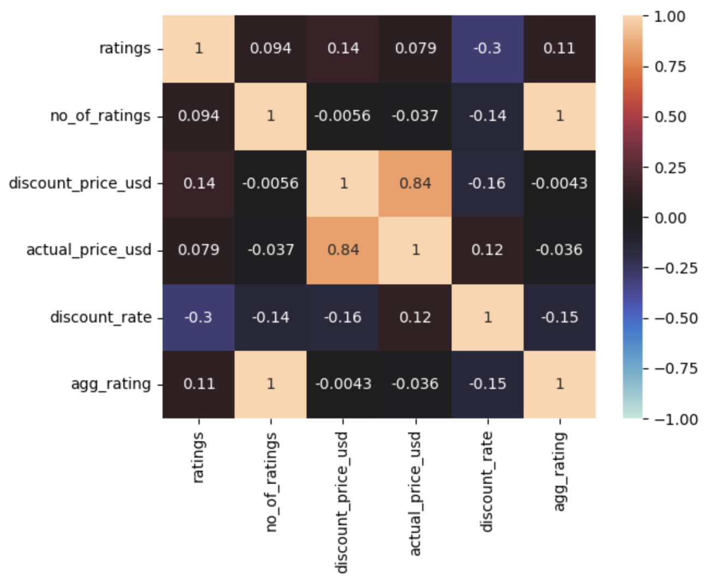
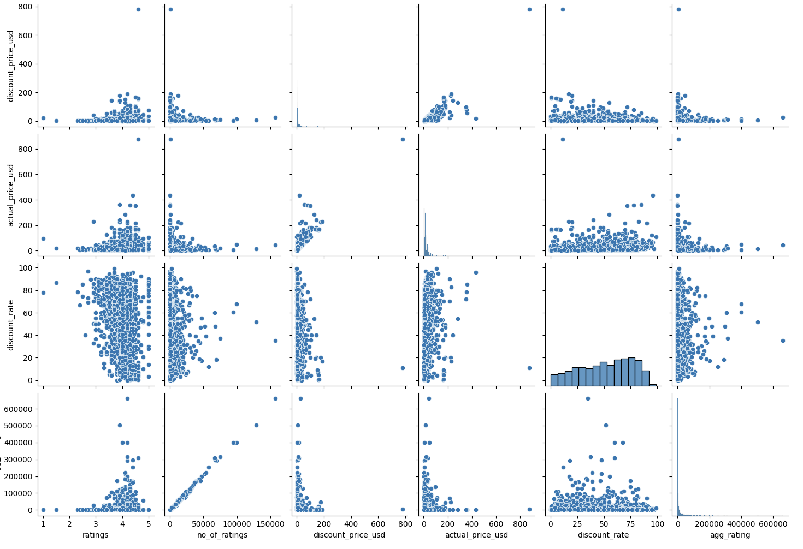
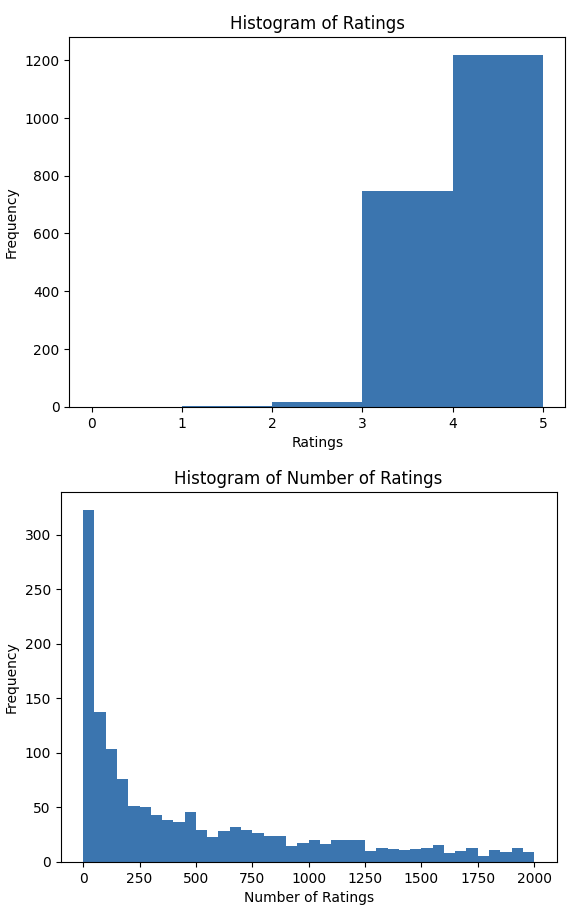
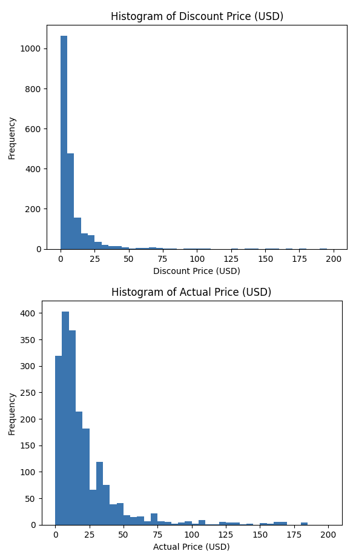

### Preprocessing
The amazon products dataset is divided into 142 subcategories. Each subcategory is represented by a .csv file. We preprocessed 3 subcategories. The categories are: televisions, amazon fashion, Luxury Beauty

For amazon fashion data, the raw data consists of 2352 observations. After excluding null values and data with random strings in the price field and ratings, the pre-processed data consists of a total of 1985 observations.

For television, the raw data consists of 1104 observations. After excluding null values and data with random strings in the price field and ratings, the pre-processed data consists of a total of 512 observations.

For luxury beauty, the raw data consists of 864 observations. After excluding null values and data with random strings in the price field and ratings, the pre-processed data consists of a total of 281 observations.

In terms of columns, the raw data had the following columns: name, main_category, sub_category, image, link, ratings, no_of_ratings, discount_price(rupee), actual_price(rupee). After our preprocessing, we now had:

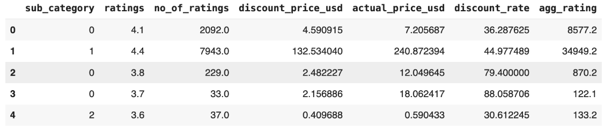

After combining all data together, we have the final shape of (2778, 7).

### Model 1: Polynomial Regression Model
We found that degree=3 polynomial regression has the lowest test mean squared error of 0.316 and training mean squared error of 0.192.

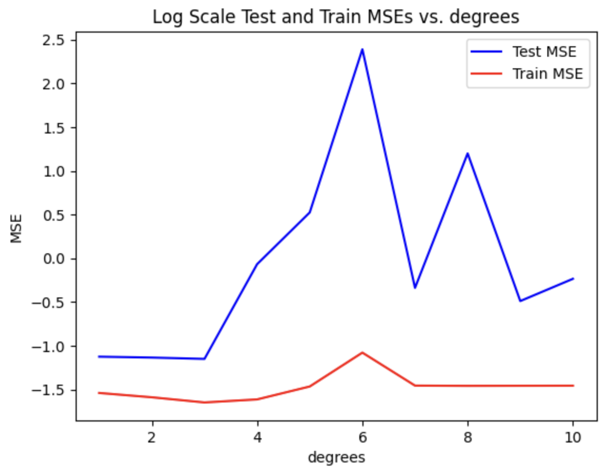

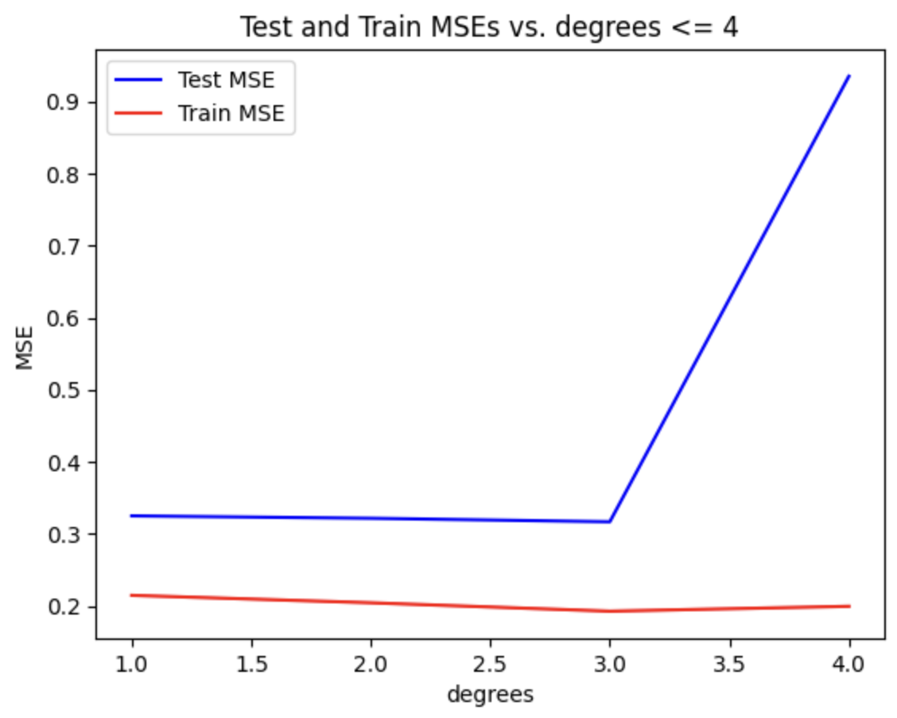

### Model 2: Artificial Neural Network
After trying out a couple different configurations, we decided that our baseline ANN is a network that uses 4 hidden layers with 32 nodes in each of the layers. We chose relu as the activation function except for the last layer, which had linear activation. This model achieved a test MSE of 0.137 and training MSE of 0.097.
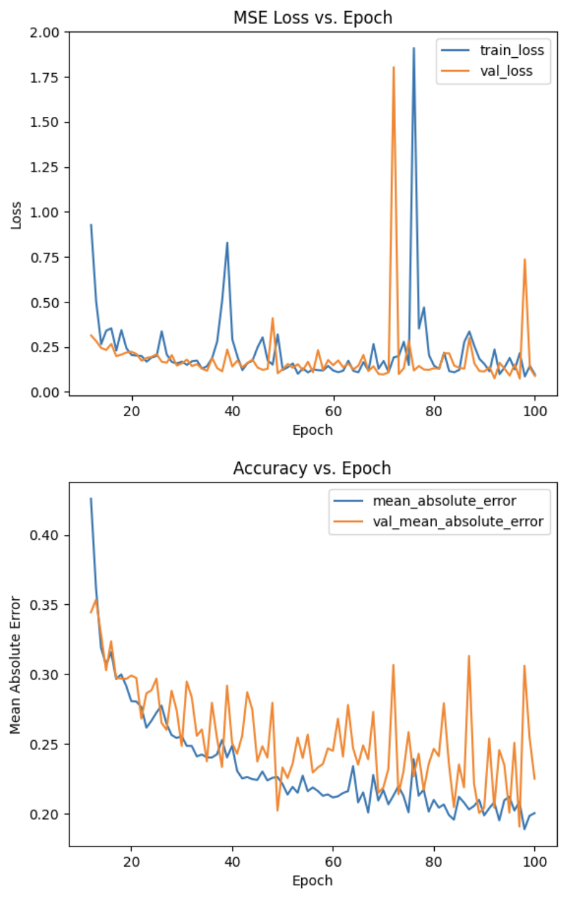

For K-Fold Cross Validation, to validate the model's performance, we conducted repeated k-fold cross-validation and achieved 0.216 as the average test MSE. 

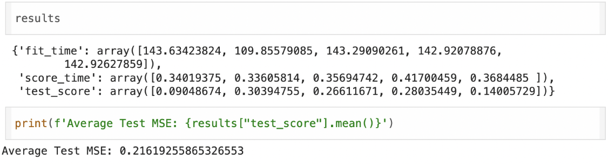

For Hyper-parameter tuning,
Furthermore, to optimize the neural network model's performance, we performed hyperparameter tuning, exploring variations such as:

- Activation function: ["relu", "tanh", "linear"]
- Loss function: ["mse", "mae"]
- Number of nodes in each layer: 16-64, step_size=8
The best model after hyperparameter tuning achieved validation mean square error of 0.02904 and test MSE of 0.0514 with the following model setup:

- Loss function: mse
- Activation function: tanh
- Number of nodes in each layer: 48

Using an optimized model, the following is a fitting graph, MSE Loss vs. Epoch and Mean Absolute Error vs. Epoch

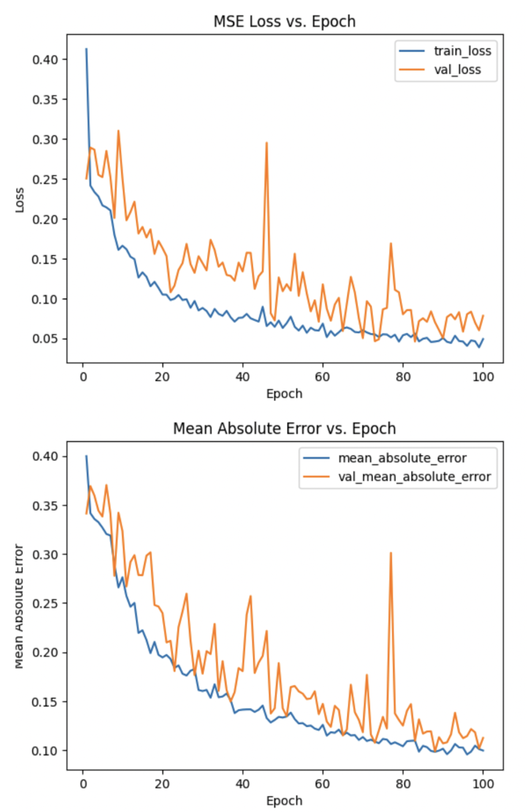

### Model 3: Decision Tree Regressor
The test MSE for the baseline model is 0.173. The train MSE for the baseline model is 0.160.

Upon performing hyper-parameter tuning, we found the following trend on the test loss:

We focused on the squared_error criterion and plotted its test loss and train loss on the same plot.
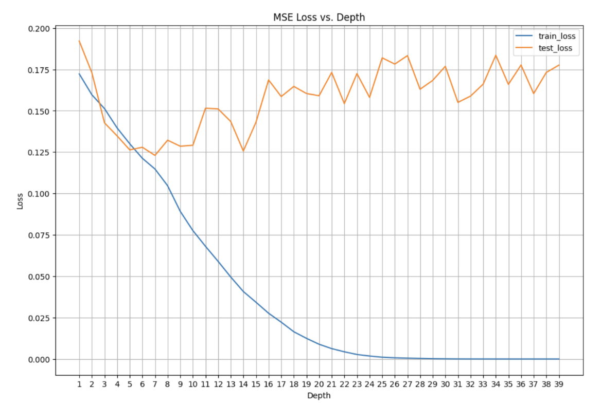

## Discussion

### Model 1: Polynomial Regression Model
Upon plotting the data distribution and finding the correlation between attributes, we concluded that the relationship between ratings and other features is non-linear. Thus, we decided to develop a polynomial regression model. Not knowing which polynomial feature would result in the best outcome, we tried degrees from 1 to 10. As you can see in Figure 1, the model shows signs of overfitting with its degree greater than 3. In fact, the degree=3 model has the lowest train and test mean squared error. Therefore, we chose the polynomial regression model with degree=3 to be our baseline model for the other two types of models that we will develop. To reiterate, the test MSE is 0.316, and the training MSE is 0.192.

Although the model seemed to have low mse for the test dataset, we forward passed some instances of the inputs to see how well our model was performing. Some instances had O(0.01) absolute difference, but some other instances had O(0.1) absolute difference. Finding this, we moved on to developing a second model that can reduce the loss significantly that we are at O(0.01) absolute difference between predicted values and actual values.

### Model 2: Artificial Neural Network
We suspected from our results from the polynomial regression model that the polynomial function might not be enough to capture the complexity of our data. Therefore, we chose to develop an Artificial Neural Network as it is good at finding complex non-linear relationships between the input data and output label. 

For ANN, we decided to train our ANN using the original rating scale of 1-5 before normalization because when we use normalized ratings, our loss function, MSE, reacts less sensitively to large errors when values are between 0 and 1 compared to the original 1-5 scale, and it causes poor performance. When using normalized data, the model especially struggled to predict for ratings of 1 and 5. Its prediction on these labels would be different by O(1). However, using the original scale of rating, predictions for ratings of 1 and 5 greatly improved.

For the baseline model, We first started by trying out a couple of different configurations, we decided that our baseline ANN is a network that uses 4 hidden layers with 32 nodes in each of the layers. We chose Relu as the activation function except for the last layer, which had linear activation. This model achieved a test MSE of 0.137 and training MSE of 0.097. To validate the model's performance, we conducted repeated k-fold cross-validation and achieved 0.216 as the average validation MSE. We believed that we could do better with an ANN and therefore, performed hyper-parameter tuning.

A random search of the hyper-paremeters space showed promising results. Unlike our assumption that Relu would be the best activation function, it found tanh as the activation function. It increased the number of nodes in each hidden layer from 32 to 48 and still used mean squared error as its loss function. This model achieved validation mean square error of 0.00204 and a test MSE of 0.0513.

Even the baseline artificial neural network produced more believable results compared to the polynomial regression. The mean squared error was significantly lower and when forward passing instances to compare the prediction with actual labels, we found that most of the instances in the test set had O(0.01) absolute difference.

To check whether the model is overfitting, we examined the training MSE and validation MSE as the number of epochs increased. For both baseline ANN model and best model after hyperparameter tuning, We observed that as epochs increased, both training MSE and validation MSE decreased gradually. This indicates that there is no overfitting of the model. 

### Model 3: Decision Tree Regressor
Given that we are now working with original data, we believed that a Decision Tree Regressor (DTR) might be a good fit. We also believed that a DTR would handle the edge cases of 1 and 5 well, which is very important in terms of keeping the mean squared error low. 

Having the baseline DTR test loss of 0.173, we performed an exhaustive search of the criterion choices and maximum number of depths. As suspected, test loss decreased as the num_depths increased. However, the decrease only happened around num_depths= 6 to 9. When num_depths increased beyond the range, test loss increased significantly, showing signs of overfitting. To investigate further, we plotted the squared_error criterion’s training and test loss against num_depths. We observed the training loss converging to zero as num_depths increases and test loss increasing. Showing clear signs of overfitting in the high num_depths region, we concluded that our best model is with hyper-paramters: num_depths=7, criterion=”squared_error.”

## Conclusion

Amazon product ratings have a significant impact on sales revenue. Therefore, developing a model that predicts what rating a product will be given for certain discount rates in a specific product category would enable sellers to enhance customer satisfaction and increase sales by carefully considering their product prices and discount rates. One drawback of this dataset is the lack of information on the number of sales, making it impossible to determine how many people purchased the product for a certain period of time. Additionally, without knowing how many people bought the product and how many provided ratings during a specific sales period, the data does not reflect current trends. Therefore, to further improve our model, we believe that more data collection would be beneficial. By utilizing more informative product data and categories to improve the model, we could create a much better-performing model which would be beneficial for the Amazon sellers. 

Furthermore, we believe that we can map ranges of ratings into classes (ex: 5.0-4.6 to A, 4.5-4.1 to B, 4.0-3.6 to C, and so on…). This approach will allow us to build a classification model that predicts rating class. We believe that it would have been meaningful for us to compare the performance of such classification models to our regression models.

## Collaboration

- Jae Min Jeon: Machine Learning Engineer, data exploration, preprocessing, polynomial_regression, ann, decision_tree_regressor, write-up
- Juhak Lee: Machine Learning Engineer, data exploration, preprocessing, polynomial_regression, ann, decision_tree_regressor, write-up

``
**We pair-programmed throughout the project
